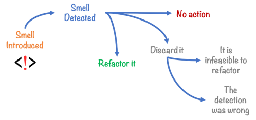

# UD5 - Optimización de código

- [UD5 - Optimización de código](#ud5---optimización-de-código)
  - [1. Refactorización](#1-refactorización)
    - [Malos olores (bad smells)](#malos-olores-bad-smells)
  - [2. Analizadores de código](#2-analizadores-de-código)


## 1. Refactorización
La __refactorización__ es una técnica de la ingeniería de software para reestructurar un código fuente, alterando su estructura interna sin cambiar su comportamiento externo.

El proceso de refactorizar busca mejorar nuestro código sin crear nuevas funcionalidades.

La idea es partir de código que está sucio y mejorarlo para conseguir que sea un código más limpio, que tenga un diseño más simple, que sea más fácil de arreglar y de modificar.

A lo largo del ciclo de vida de una aplicación es muy frecuente tener que realizar cambios por diferentes motivos. Estos cambios son parte del mantenimiento del código y se clasifican en tres grupos:
- Mantenimiento perfectivo: busca incorporar funcionalidades o requisitos pedidos por el cliente.
- Mantenimiento correctivo: busca corregir fallos detectados por el cliente tras la entrega del software.
- Mantenimiento adaptativo: tiene como objetivo que se pueda utilizar la aplicación en nuevos entornos de software o hardware.

Refactorizar nos ayuda a tener un código fuente sencillo y bien estructurado y facilita los mantenimientos.

Los principales objeticos de la refactorización son:
- Limpiar el código, mejorando la consistencia y la claridad.
- Facilitar el mantenimiento del código, sin corregir errores ni añadir funcionalidades.
- Eliminar código “muerto”.
- Facilitar el futuro mantenimiento y modificación del código.

Por el contrario, refactorizar:
- No consiste en depurar, el código debe estar en funcionamiento.
- No es lo mismo que optimizar, no busca mejorar el rendimiento del programa.

Al realizar refactorizacion se puede realizar de dos formas:
- Refactorización continua, la forma más adecuada de refactorizar. De esta forma realizaremos pequeñas refactorizaciones frecuentemente, de este modo desarrollaremos código limpio y optimizaremos el proceso de codificación.
- Refactorización completa. Se realiza cuando tenemos la aplicación desarrollada y no tenemos otra opción que refactorizar todo el código. 

### Malos olores (bad smells)
los malos olores en el desarrollo de software es un síntoma en el código que indica que posiblemente exista un problema más profundo. Usualmente no sose tratan de un bugs o errores de programación (no son técnicamente incorrectos y no impiden que el programa funcione correctamente). 



Detectar malos olores en el código es un motivo importante para realizar refactorización. Podemos organozar los bad smells según el nivel al que afectan:

Dentro de clases:
1. Método extenso (Long method): La longitud del metodo hace mas dificil ver lo que hace.
2. Lista de parametros extensa (Long parameter list): Pasar extrictamente lo necesario.
3. Código duplicado (Ducplicate code): Obliga a hacer mantenimiento en varias partes.
4. Clase extensa (Large class): Clase que esta tratando de hacer demasiado.
5. Tipo incorporado en nombre (Type embedded in name): Redundancia en los nombres, clase.addListener(listener) por clase.add(listener).
6. Nombre no comunicativo (Uncommunicative name): Colocar nombre el correcto que indica lo que se hace.
7. Código muerto (Dead code): Variables, metodos, parametros, clases, fragmentos que no se usan en ninguna parte.
8. Generalización especulativa (Speculative generality): No generalizar el código intentando predecir necesidades futuras.

Entre clases:
1. Obsesión primitiva (Primitve obsession): Usar tipos primitivos para sustituir datos que pueden ser representados con una clase. Ej: Dinero (cantidad y moneda), teléfono (área y numero).
2. Clase dato (Data class): Clases con solo getters y setters de atributos y sin comportamiento(anemic model).
3. Grupo de datos (Data clumps): Grupos de atributos que siempre estan juntos en vez de agruparlos en una unica clase.
4. Legado rechazado (Refused bequest): Subclases que no quieren o no necesitan todo lo que heredan. Es necesario heredar entonces?
5. Intimidad inapropiada (Inappropriate intimacy): Dos clases se conocen demasiado.
6. Clase perezosa (Lazy class): Clase que no hace lo suficiente.
7. Envidia de características (Feature envy): Métodos que usan intensivamente otra clase que aquella a la que pertenecen.
8. Cadena de mensajes (Message chains): Secuencia de llamadas extensa de un método a otro `obj.getAlgo().getOtraCosa().getOtroMas().esto().`
9. Intermediario (Middle man): Cuando una clase delega su trabajo haciendo llamadas a otras clases. Entonces para que existe?
10. Cambio divergente (Divergent change): Cambios hechos dentro de una clase que no tienen ninguna relación con las otras funcionalidades de la clase.
11. Cirugía escopeta (Shotgun surgery): Cuando se cambia una clase y se produce una cascada de cambios en otras clases.
12. Jerarquía de herencia paralela (Parallel Inheritance Hierarchies): Si al crear una subclase de la clase X es necesario hacer otra subclase de otra clase Y.

### Convenciones y nomenclatura
Para conseguir un código límpio es necesario adaptarse a las normas del lenguaje de programación. Las convenciones de programación son un conjunto de directrices para un lenguaje de programación concreto que recomienda estilo, prácticas, y métodos de programación para cada aspecto de un programa escrito en cada lenguaje.

#### Ficheros:
Los ficheros fuente de java son ficheros de texto plano cuyo nombre termina con la extensión .java. Dentro de cada fichero .java tenemos 4 partes en el siguiente orden:
- Comentarios sobre la clase (autor, fecha, licencias, etc)
- Sentencia package. Toda clase debe estar en un paquete.
- Sentencias import. Importar cada clase en una línea separada.
- La definición de una única clase o interface cuyo nombre es idéntico al nombre del fichero sin la extensión.

Dentro de la definición de la clase, se aplica el siguiente orden:
- Sentencia class o interface
- Variables de clase (static)
- Variables de instancia (Atributos de la clase)
- Constructores (Si hay sobrecarga deben ir seguidos)
- Métodos (Si hay sobrecarga deben ir seguidos)

#### Declaración de variables:
- Una única declaración por línea
```Java
int edad;
int cantidad;
```
- Las variables locales se deben inicializar en el momento de declararlas o justo después. Se declaran justo antes de su uso, para reducir su ámbito.
- Las variables de instancia o de clase se declaran al comienzo de la definición de la clase.
- Los arrays se pueden inicializar en bloque:
```Java
int[] array = { 0, 1, 2, 3 };
```
- Los arrays tienen los corchetes [ ] unidos a su tipo de datos:
```Java
String[] nombres; // correcto
String nombres[]; // incorrecto
```

#### Nombres e identificadores
Para los identificadores podemos usar las letras anglosajonas y números de la tabla ASCII. No se debe usar caracteres con tilde ni la (ñ). Las barras bajas o guiones tampoco se usan. 

- Los nombres de los identificadores deben ser siempre lo más descriptivos posible. Solo se usan identificadores de un solo carácter para representar los contadores del bucle for, comenzando por la letra i.
- Nombre de Package: siempre en minúsculas.
- Nombre de las clases o interfaces: _UpperCamelCase_.
- Nombre de los métodos: _lowerCamelCase_. Suelen ser verbos o frases.
- Nombres de constantes: CONSTANT_CASE. Todo el mayúsculas, separando con barra baja.
- Variables locales, atributos de la clase, nombres de parámetros: _lowerCamelCase_.

### Técnicas de refactorización

- Renombrado (rename): Este patrón nos indica que debemos cambiar el nombre de un paquete, clase, método o campo, por un nombre más significativo.
```Java
int a = alto * ancho;       // incorrecto
int area = alto * ancho;    // correcto
```
Además, hay que evitar los _Magic Numbers_. Un Magic Number es un valor literal (“texto” o numérico) empleado en el código sin ninguna explicación. Se deben sustituir siempre que se pueda por una constante que identifique su finalidad.

Incorrecto:
```Java
int precioConIva = precioBase + (0.21 * precioBase);
```
Correcto:
```Java
final static double IVA = 0.21;
int precioConIva = precioBase + (IVA * precioBase);
```
- Mover la clase: Si es necesario, se puede mover una clase de un paquete a otro, o de un proyecto a otro. La idea es no duplicar código que ya se haya generado. Esto impone la actualización en todo el código fuente de las referencias a la clase en su nueva localización.
- Extract interface: Crea un nueva interfaz de los métodos public non‐static seleccionados en una clase o interfaz. 

Sin refactorizar:
```Java
class Person {
  get officeAreaCode() {return this._officeAreaCode;}
  get officeNumber()   {return this._officeNumber;}
```
Refcatorizado:
```Java
class Person {
  get officeAreaCode() {return this._telephoneNumber.areaCode;}
  get officeNumber()   {return this._telephoneNumber.number;}
}
class TelephoneNumber {
  get areaCode() {return this._areaCode;}
  get number()   {return this._number;}
}
```
- Mover del interior a otro nivel: Consiste en mover una clase interna a un nivel superior en la jerarquía.
- Borrado seguro: Se debe comprobar, que cuándo un elemento del código ya no es necesario, se han borrado todas las referencias a él que había en cualquier parte del proyecto. 
- Campos encapsulados: Se aconseja crear métodos getter y setter, (de asignación y de consulta) para cada campo que se defina en una clase. Cuando sea necesario acceder o modificar el valor de un campo, basta con invocar al método getter o setter según convenga.
- Sustituir bloques de código por un método: Este patrón nos aconseja sustituir un bloque de código, por un método. De esta forma, cada vez que queramos acceder a ese bloque de código, bastaría con invocar al método.

> En la siguiente página web encontrarás michas técnicas de refactorización en el catálogo de Martin Fowler: https://refactoring.com/ 

## 2. Analizadores de código

NetBeans incluye herramientas de refactorización que se pueden encontrar en el siguiente enlace: https://netbeans.apache.org/kb/docs/java/editor-inspect-transform.html 