# UD6 - Elaboración de diagramas de clases

- [UD6 - Elaboración de diagramas de clases](#ud6---elaboración-de-diagramas-de-clases)
  - [1. Conceptos básicos de la orientación a objetos](#1-conceptos-básicos-de-la-orientación-a-objetos)
  - [2. UML](#2-uml)
    - [2.1 Elementos UML](#21-elementos-uml)
      - [Elementos estructurales](#elementos-estructurales)
      - [Elementos de comportamiento](#elementos-de-comportamiento)
      - [Elementos de agrupación](#elementos-de-agrupación)
      - [Elementos de anotación](#elementos-de-anotación)
    - [2.2 Diagramas UML](#22-diagramas-uml)
      - [Diagramas estructurales](#diagramas-estructurales)
      - [Diagramas de comportamiento](#diagramas-de-comportamiento)
        - [Diagramas de interacción.](#diagramas-de-interacción)
  - [3. Clases, atributos, métodos y visibilidad](#3-clases-atributos-métodos-y-visibilidad)
  - [4. Relaciones entre clases](#4-relaciones-entre-clases)
    - [4.1 Agregación](#41-agregación)
    - [4.2 Composición](#42-composición)
    - [4.3 Especialización y generalización](#43-especialización-y-generalización)
    - [4.4 Asociación](#44-asociación)
    - [4.5 Realización](#45-realización)
  - [5. Tipos de clases de análisis](#5-tipos-de-clases-de-análisis)
  - [6. Herramientas para la creación de diagramas de clases](#6-herramientas-para-la-creación-de-diagramas-de-clases)
  - [7. Generación de código a partir de diagramas de clases](#7-generación-de-código-a-partir-de-diagramas-de-clases)
  - [8. Generación de diagramas de clases a partir de código (ingeniería inversa)](#8-generación-de-diagramas-de-clases-a-partir-de-código-ingeniería-inversa)

El proceso de construcción de software tiene como finalidad solucionar problemas utilizando herramientas informáticas y, para obtener buenos resultados, requiere un proceso previo de análisis y especificación de requisitos. La programación orientada a objetos se enfoca en simular elementos de la realidad del problema de manera cercana a través de la abstracción de objetos. Estos objetos se caracterizan por tener un conjunto de atributos que los definen y un conjunto de operaciones que marcan su comportamiento.

## 1. Conceptos básicos de la orientación a objetos

Claves de la programación orientada a objetos:
- **Abstracción**: permite modelar la realidad mediante la creación de clases que capturan características y comportamientos similares.
- **Encapsulación**: reúne elementos relacionados en un mismo nivel de abstracción, aumentando la cohesión de los componentes del sistema.
- **Modularidad**: permite dividir una aplicación en partes independientes y reducir su complejidad.
- **Principio de ocultación**: limita el acceso a ciertas propiedades de los objetos, reduciendo la propagación de efectos colaterales cuando se producen cambios.
- **Herencia**: permite que los objetos utilicen las propiedades y comportamientos de otros objetos, formando una jerarquía.
- **Polimorfismo**: agrupa comportamientos diferentes bajo el mismo nombre, seleccionando uno u otro dependiendo del objeto que lo ejecute.
- **Recolección de basura**: se encarga de destruir automáticamente los objetos sin referencia, desvinculando su memoria asociada.

El paradigma de programación orientada a objetos tiene diversas **ventajas** en el desarrollo de software en comparación con otros paradigmas:

- Permite un desarrollo más rápido, económico y de mayor calidad gracias a la reutilización de código modular, lo que facilita la creación de aplicaciones similares y la reutilización de código.
- Mejora la calidad del sistema al hacerlo más extensible y permitir la fácil modificación de la funcionalidad de la aplicación a través de la modificación de operaciones.
- Es más fácil de modificar y mantener debido a la modularidad y encapsulación de objetos con responsabilidades independientes y claramente definidas.
- Facilita la adaptación y escalabilidad de las aplicaciones gracias a la capacidad de modificar la estructura y el comportamiento de los objetos sin tener que cambiar la aplicación completa.

## 2. UML
__UML__, o __Lenguaje Unificado de Modelado__, es un lenguaje gráfico respaldado por el [Object Management Group (OMG)](https://es.wikipedia.org/wiki/Object_Management_Group) que se utiliza ampliamente para visualizar, especificar, construir y documentar sistemas de software. Es el lenguaje en el que se describe el modelo y ofrece un estándar para describir el "plano" del sistema, incluyendo aspectos conceptuales y concretos.

UML es un "lenguaje de modelado" utilizado para especificar métodos y procesos en el desarrollo de software, y se puede aplicar en una gran variedad de metodologías de desarrollo. Sin embargo, UML no especifica en sí mismo qué metodología o proceso utilizar.

UML permite a los equipos de desarrollo visualizar el trabajo realizado en esquemas o diagramas estandarizados denominados modelos, que representan el sistema desde diferentes perspectivas. Al diseñar el modelo de un sistema utilizando UML, es importante seguir los siguientes principios básicos:
- La elección de qué modelos crear debe realizarse cuidadosamente, ya que esto influirá en cómo se aborda un problema y se da forma a la solución.
- Es posible expresar un modelo con diferentes niveles de precisión, lo que permite adaptarse a diferentes necesidades y situaciones.
- Los mejores modelos son aquellos que están estrechamente vinculados con la realidad del sistema que se está modelando.
- Es recomendable utilizar un conjunto de modelos casi independientes y desde múltiples puntos de vista para abordar cualquier sistema complejo, ya que un único modelo o vista no es suficiente.

### 2.1 Elementos UML
En el lenguaje UML podemos encontrar cuatro tipos de elementos, pueden ser estructurales, de comportamiento, de agrupación o de anotación. A continuación se explican los elementos de UML más importantes junto a su representación.

#### Elementos estructurales
Los elementos estructurales de un modelo son su parte estática y representan conceptos o cosas materiales. Son elementos estructurales: 
- Clase: describe un grupo de objetos que comparte atributos, operaciones, relaciones y semántica.

- Interfaz: colección de operaciones que especifican un servicio de una clase o componente. Describe el comportamiento de un elemento visto desde el exterior del mismo. Una interfaz especifica el nombre de las operaciones, los datos que hay que proporcionarle y los datos que devuelven, pero no concreta cómo se realizan dichas operaciones ni cómo se implementan. 

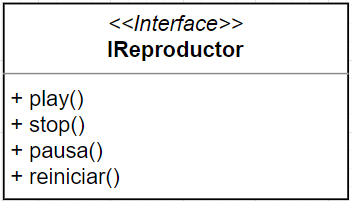

- Colaboración: define una interacción y se trata de un conjunto de roles y otros elementos que colaboran para proporcionar un comportamiento cooperativo mayor que la suma de los comportamientos de sus elementos.

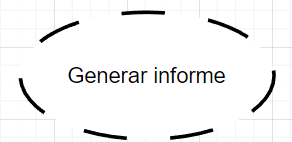

- Caso de uso: es la descripción de una acción realizada por un sistema, clase o componente desde el punto de vista del usuario.

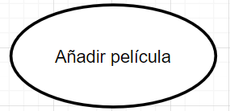

- Componente: representa una parte modular de un sistema. El sistema se define partiendo de los componentes que están conectados entre sí. La implementación de un componente puede expresarse conectando partes y conectores, y las partes pueden incluir componentes más pequeños.

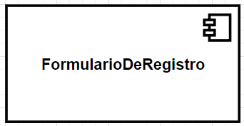

- Artefacto: es la especificación de un componente físico de información que es usado o producido por un proceso de desarrollo de software, o por el desarrollo y operación de un sistema. 

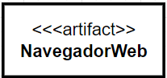

- Nodo: es un elemento físico que representa un recurso computacional, por ejemplo, un servidor web.

#### Elementos de comportamiento
Los elementos de comportamiento representan las partes dinámicas de un modelo UML. Sirven para conectar los elementos estructurales. Existen tres tipos:
- Interacción:

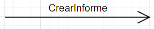

- Máquina de estados:

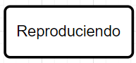

- Actividad:

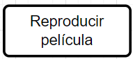

#### Elementos de agrupación
Son los elementos organizativos de los modelos UML.

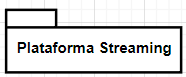

#### Elementos de anotación

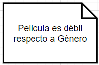

### 2.2 Diagramas UML

#### Diagramas estructurales
Los diagramas estructurales muestran la estructura estática del sistema y sus partes en diferentes niveles de abstracción. Existen un total de siete tipos de diagramas de estructura:

- Diagrama de clases: Muestra la estructura del sistema, subsistema o componente utilizando clases con sus características, restricciones y relaciones: asociaciones, generalizaciones, dependencias, etc.
- Diagrama de componentes: Muestra componentes y dependencias entre ellos. Este tipo de diagramas se utiliza para el desarrollo basado en componentes (CDB), para describir sistemas con arquitectura orientada a servicios (SOA).
- Diagrama de despliegue: Muestra la arquitectura del sistema como despliegue (distribución) de artefactos de software.
- Diagrama de objetos: Un gráfico de instancias, incluyendo objetos y valores de datos. Un diagrama de objeto estático es una instancia de un diagrama de clase; muestra una instantánea del estado detallado de un sistema en un punto en el tiempo.
- Diagrama de paquetes: Muestra los paquetes y las relaciones entre los paquetes.
- Diagrama de perfiles: Diagrama UML auxiliar que permite definir estereotipos personalizados, valores etiquetados y restricciones como un mecanismo de extensión ligero al estándar UML. Los perfiles permiten adaptar el metamodelo UML para diferentes plataformas o dominios.
- Diagrama de estructura compuesta: Muestra la estructura interna (incluidas las partes y los conectores) de un clasificador estructurado.

#### Diagramas de comportamiento
A diferencia de los diagramas estructurales, muestran como se comporta un sistema de información de forma dinámica. Es decir, describe los cambios que sufre un sistema a través del tiempo cuando está en ejecución. Hay un total de siete diagramas de comportamiento, clasificados de la siguiente forma:

- Diagrama de actividades: Muestra la secuencia y las condiciones para coordinar los comportamientos de nivel inferior, en lugar de los clasificadores que poseen esos comportamientos. Estos son comúnmente llamados modelos de flujo de control y flujo de objetos.
- Diagrama de casos de uso: Describe un conjunto de acciones (casos de uso) que algunos sistemas o sistemas (sujetos) deben o pueden realizar en colaboración con uno o más usuarios externos del sistema (actores) para proporcionar algunos resultados observables y valiosos a los actores u otros interesados ​​del sistema(s).
- Diagrama de máquina de estados: Se utiliza para modelar el comportamiento discreto a través de transiciones de estados finitos. Además de expresar el comportamiento de una parte del sistema, las máquinas de estado también se pueden usar para expresar el protocolo de uso de parte de un sistema.

##### Diagramas de interacción.
Es un subconjunto de los diagramas de comportamiento. Comprende los siguientes diagramas:

- Diagrama de secuencia: Es el tipo más común de diagramas de interacción y se centra en el intercambio de mensajes entre líneas de vida (objetos).
- Diagrama de comunicación: Se enfoca en la interacción entre líneas de vida donde la arquitectura de la estructura interna y cómo esto se corresponde con el paso del mensaje es fundamental. La secuencia de mensajes se da a través de una numeración.
- Diagrama de tiempos: Se centran en las condiciones que cambian dentro y entre las líneas de vida a lo largo de un eje de tiempo lineal.
- Diagrama global de interacciones: Los diagramas global de interacciones brindan una descripción general del flujo de control donde los nodos del flujo son interacciones o usos de interacción.

## 3. Clases, atributos, métodos y visibilidad

Los propósitos de una clase son definir las abstracciones y favorecer la modularidad. Una clase se describe por un conjunto de elementos que se denominan miembros y que son:
- Nombre.
- Atributos: conjunto de características asociadas a una clase. Pueden verse como una relación binaria entre una clase y cierto dominio formado por todos los posibles valores que puede tomar cada atributo. Cuando toman valores concretos dentro de su dominio definen el estado del objeto. Se definen por su nombre y su tipo, que puede ser simple o compuesto como otra clase.
- Protocolo: Operaciones (métodos, mensajes) que manipulan el estado. Un método es el procedimiento o función que se invoca para actuar sobre un objeto. Un mensaje es el resultado de cierta acción efectuada por un objeto. Los métodos determinan como actúan los objetos cuando reciben un mensaje, es decir, cuando se requiere que el objeto realice una acción descrita en un método se le envía un mensaje. El conjunto de mensajes a los cuales puede responder un objeto se le conoce como protocolo del objeto.

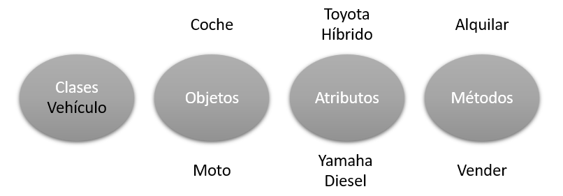

## 4. Relaciones entre clases

### 4.1 Agregación

### 4.2 Composición

### 4.3 Especialización y generalización

### 4.4 Asociación

### 4.5 Realización

## 5. Tipos de clases de análisis

## 6. Herramientas para la creación de diagramas de clases
Existen muchas herramientas para crear diagramas de clases. Algunas de las más conocidas son:
- **draw.io**: Destaca por su sencillez. Simplemente accediendo a draw.io en su navegador tienes un lienzo vacío para comenzar a dibujar. Viene con formas para modelado UML básico, ER y BPMN. Aún así, es un claro ejemplo de una herramienta que no entiende realmente la semántica de lo que estás dibujando, así que básicamente puedes hacer lo que quieras y utilizarlo para construir tus diagramas uml online gratis muy extraños que no cumplen a rajatabla las normas. También falla en el aspecto de colaboración, pero se integra bien con Google Drive, Dropbox, OneDrive y otros para guardar automáticamente los modelos en su ubicación preferida. Draw.io es de código abierto y se ha creado utilizando la biblioteca mxGraph.
- **Modelio**:

> Actividad: draw.io

> Actividad: Modelio

## 7. Generación de código a partir de diagramas de clases

## 8. Generación de diagramas de clases a partir de código (ingeniería inversa)

