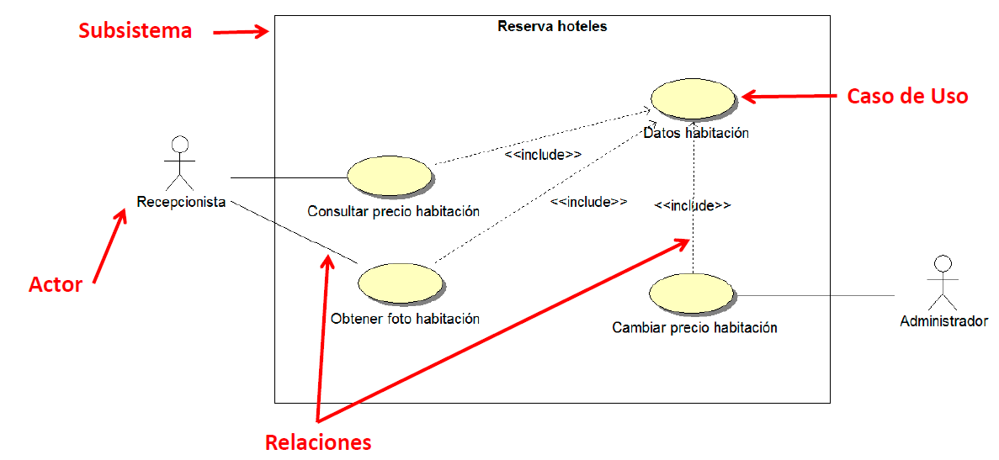
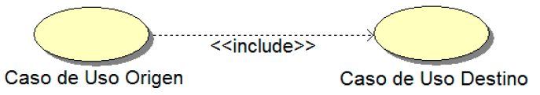
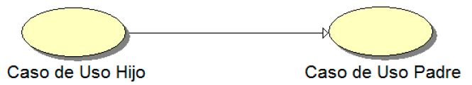
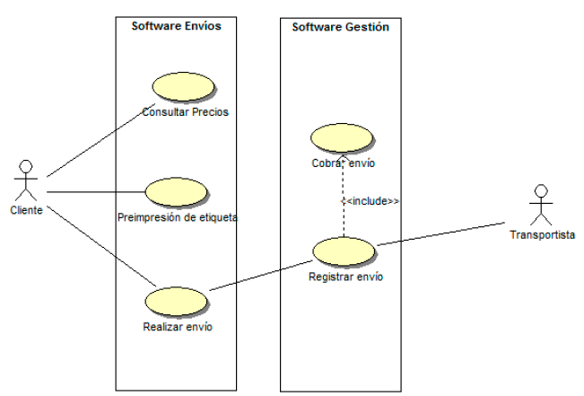
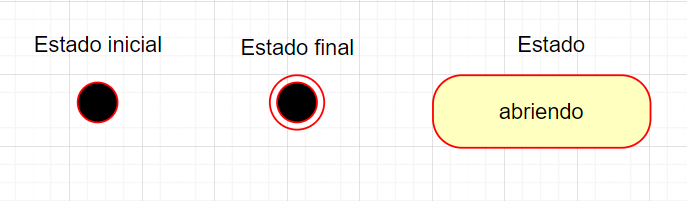
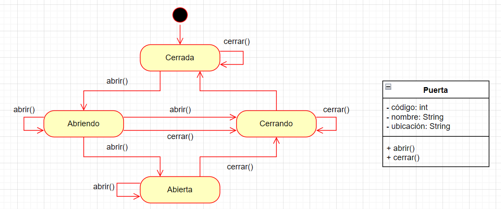

# UD7 - Elaboración de diagramas de comportamiento

- [UD7 - Elaboración de diagramas de comportamiento](#ud7---elaboración-de-diagramas-de-comportamiento)
  - [1. Diagramas de casos de uso](#1-diagramas-de-casos-de-uso)
  - [2. Diagramas de estados](#2-diagramas-de-estados)
  - [3. Diagramas de actividades](#3-diagramas-de-actividades)

Los diagramas de comportamiento UML sirven para visualizar el comportamiento dinámico de un sistema. Reflejan como cambian a lo largo del tiempo determinadas actividades del sistema.

Se utilizan para entender el comportamiento que deben tener determinados procesos y mostrar el funcionamiento global del sistema a través de los diferentes procesos que ejecuta.

## 1. Diagramas de casos de uso

Los Casos de Uso describen el comportamiento de un sistema desde el punto de vista del usuario. Se utiliza para describir la funcionalidad del sistema independientemente de la implementación.

Un Caso de Uso es el único elemento de UML que describe el sistema desde el punto de vista del usuario. Entender el punto de vista del usuario es fundamental para crear sistemas que cumplan con los requerimientos de quién lo va a utilizar y para que sea sencillo de trabajar con ellos. Los casos de uso son fundamentales en la fase de análisis de un sistema, donde se estudia y representa la forma en que los usuarios utilizan un sistema.

Los diagramas de casos de uso son una herramienta que permite que los usuarios potenciales hablen de un sistema desde su propio punto de vista. Implica involucrar a los usuarios en las etapas iniciales de análisis y diseño del sistema. Desde ese punto de vista, definimos un Caso de Uso como un conjunto de situaciones respecto a la utilización del sistema.

A continuación se explican los diferentes elementos de un diagrama de casos de uso:

- **Actor**: Representa el rol de un usuario del sistema. Todo aquel elemento que interactúa con el sistema
    - Tipos de actores:
    - Principales: personas que usan el sistema
    - Secundarios: personas que mantienen o administran el sistema
    - Material externo: dispositivos materiales imprescindibles que forman parte del ámbito de la aplicación y deben ser utilizados
    - Otros sistemas: otros entornos con los que el sistema interactúa
- **Caso de Uso**: Indica un proceso dentro del propio sistema
- **Relación**: Cualquier tipo de unión entre elementos del diagrama. Permite conocer las dependencias de los distintos elementos del diagrama, formando secuencias de Casos de Uso que representan procesos completos.
- **Comunicación**: Relación que indica que un Actor o Caso de Uso origen utiliza un Caso de Uso destino. Forma secuencias de Casos de Uso y es el tipo de relación más utilizada.
- **Inclusión**: Utilizado cuando una instancia del Caso de Uso origen incluye también el comportamiento descrito por el Caso de Uso destino. Utilizado para Casos de Uso más complejos que requieren la utilización de otros Casos de Uso. No puede utilizarse en la relación Actor-Caso de Uso. Se representa mediante una línea a puntos acompañada de _<< include >>_.

- **Extensión**: El Caso de Uso origen extiende el comportamiento del Caso de Uso destino. Tanto la inclusión como la extensión se hace en puntos indicados y de manera específica dentro de una secuencia de casos de uso. No se permite en la relación Actor-Caso de Uso. Se representa mediante una línea a puntos acompañada de _<< extend >>_.

- **Herencia**: El Caso de Uso origen hereda la especificación del Caso de Uso destino y posiblemente la modifica y/o amplía.

- **Subsistema**: Se pueden agrupar varios Casos de Uso en subsistemas. Representan diferentes sistemas semi-independientes en un ámbito funcional dentro del sistema general. Por ejemplo: 

## 2. Diagramas de estados

Diagrama de comportamiento desde el punto de vista de los objetos del sistema. Muestra los estados por los que puede pasar uno o varios objetos durante la ejecución de determinados procesos. Se utiliza para reflejar el comportamiento de los objetos del sistema a través de su ciclo de vida.

Un Diagrama de Estados muestra una Máquina de Estados con el comportamiento del objeto. Una máquina de estados especifica las secuencias de estados por las que pasa un objeto a lo largo de su vida en respuesta a eventos, junto con sus respuestas a esos eventos. Un diagrama de estados muestra los diferentes estados de un objeto, así como el tránsito entre ellos en respuesta a determinados eventos, tanto internos como externos.

Un estado es cada condición del objeto en un determinado instante de tiempo. Se asume que el objeto se encuentra realizando una actividad o a la espera de un evento que le permita el cambio a otro estado.

Un evento es un acontecimiento o estímulo que activa una transición entre estados. 

Una transición es el proceso en el que se realiza un cambio de estado. Se realiza como respuesta a un evento específico y viene acompañada de la realización de un conjunto de acciones por parte del objeto que realiza el cambio entre estados.

La representación de los elementos de un diagrama de estados es la siguiente:

A contianuación se muestra un ejemplo de diagrama de estados por los que puede pasar una puerta:

## 3. Diagramas de actividades

Muestra el paso a paso de las diferentes actividades del sistema. Se utilizan para modelar el comportamiento de determinados procesos del sistema, modelar el comportamiento de procesos complejos que engloben varios subprocesos y representar el flujo de negocio del sistema.

