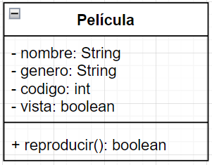
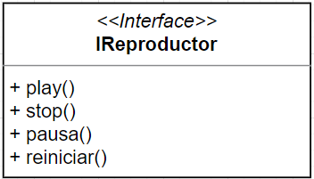
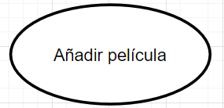
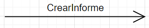
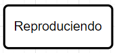
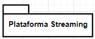

### 2.1 Elementos UML
En el lenguaje UML podemos encontrar cuatro tipos de elementos, pueden ser estructurales, de comportamiento, de agrupación o de anotación. A continuación se explican los elementos de UML más importantes junto a su representación.

#### Elementos estructurales
Los elementos estructurales de un modelo son su parte estática y representan conceptos o cosas materiales. Son elementos estructurales: 
- Clase: describe un grupo de objetos que comparte atributos, operaciones, relaciones y semántica.

- Interfaz: colección de operaciones que especifican un servicio de una clase o componente. Describe el comportamiento de un elemento visto desde el exterior del mismo. Una interfaz especifica el nombre de las operaciones, los datos que hay que proporcionarle y los datos que devuelven, pero no concreta cómo se realizan dichas operaciones ni cómo se implementan. 

- Colaboración: define una interacción y se trata de un conjunto de roles y otros elementos que colaboran para proporcionar un comportamiento cooperativo mayor que la suma de los comportamientos de sus elementos.

- Caso de uso: es la descripción de una acción realizada por un sistema, clase o componente desde el punto de vista del usuario.

- Componente: representa una parte modular de un sistema. El sistema se define partiendo de los componentes que están conectados entre sí. La implementación de un componente puede expresarse conectando partes y conectores, y las partes pueden incluir componentes más pequeños.

- Artefacto: es la especificación de un componente físico de información que es usado o producido por un proceso de desarrollo de software, o por el desarrollo y operación de un sistema. 

- Nodo: es un elemento físico que representa un recurso computacional, por ejemplo, un servidor web. Se representa con un cubo sobre el que se escribe el recurso que representa.

#### Elementos de comportamiento
Los elementos de comportamiento representan las partes dinámicas de un modelo UML. Sirven para conectar los elementos estructurales. Existen tres tipos:
- Interacción: engloba un cojunto de mensajes intercambiados entre objetos con un propósito concreto. Un mensaje se representa gráficamente por medio de una flecha con el nombre de la operación sobre ella.

- Máquina de estados: especifica el comportamiento de un objeto mediante las secuencias de estados por los que pasa. 

- Actividad: especifica los pasos que ejecuta un proceso. En una actividad lo más importante es la secuencia o el flujo de pasos, sin importar qué objeto ejecuta cada paso.

#### Elementos de agrupación
Son los elementos organizativos de los modelos UML. Los elementos básicos de agrupación son los paquetes pero existen otros como los frameworks.

#### Elementos de anotación
Son comentarios que sirven como explicación de los modelos UML creados.

